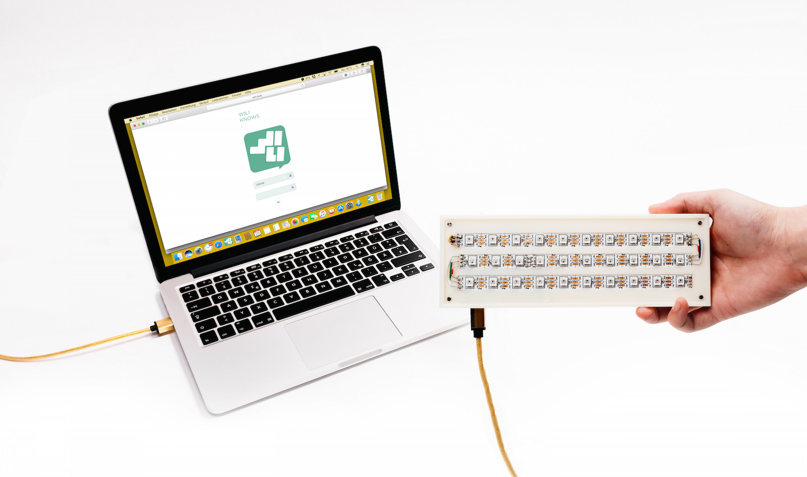

# wili
Wili Pakete Sammlung

## Wili Knows
### Wili knows ist der Versuch einen Schritt rückwärts
Unsere Idee dahinter ist schnell erklärt. Das digitale Zeitalter und vor allem das Smartphone bündelt und vereint immer mehr, alle nötigen und unnötigen Information des täglichen Gebrauchs. Um dem Sog und resultierenden Zeitfresser zu umgehen, arbeiten wir an einer Plattform die es jedem individuell ermöglicht, Information in simpler ästhetischer und zurückhaltender Form wieder in unseren realen Lebensraum zu bringen.

### Mit Wili keinen Bus mehr verpassen
Mit unserem Start-Release, gehst du stressfrei aus dem Haus und auch wieder rechtzeitig aus dem Büro. Wili zeigt dir deine gewünschten Abfahrtszeiten inklusive der Wegzeit an. Finde einen passenden Ort dafür, konfiguriere alles per W-Lan oder USB, schenk dir eine Tasse Kaffee ein und warte bis Wili dir anzeigt wann du los musst.

## Erstellen und signieren neuer Wili Pakete
Erstelle und signiere ein Tar Archiv
1. ``tar cfvz {PACKAGE-NAME}.tar.gz {PACKAGE-NAME}``
2. ``openssl smime -encrypt -binary -aes256 -in {PACKAGE-NAME}.tar.gz -out {PACKAGE-NAME}.wili -outform DER wili.public.pem``
